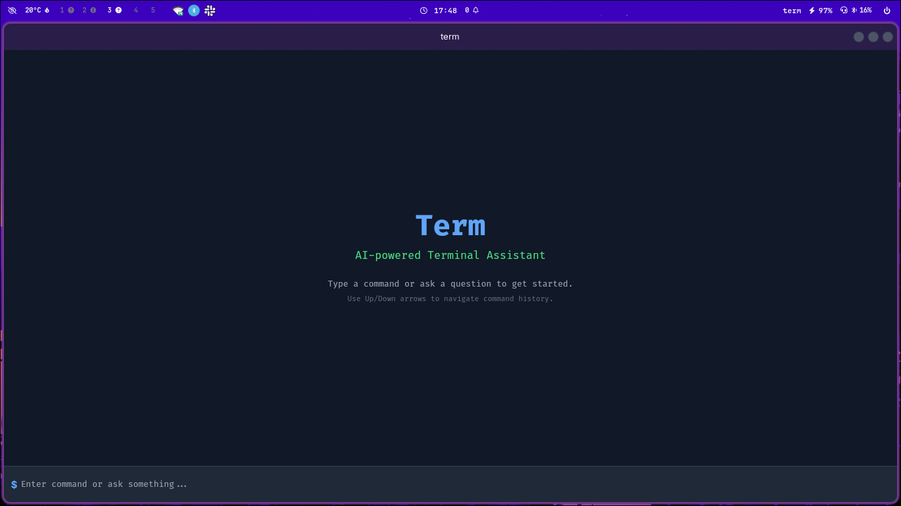
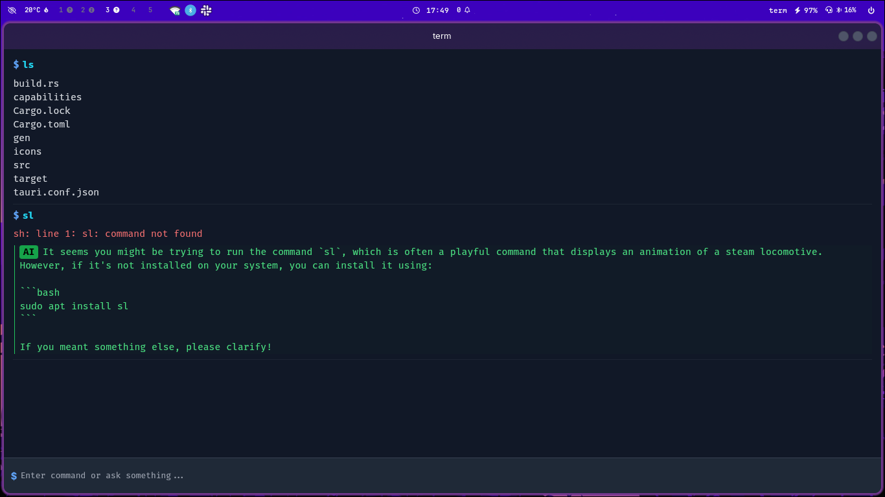

# Term - Minimal AI Terminal Assistant

A cross-platform, AI-powered terminal assistant with custom commands, local API key storage, and autocompletion. Built using **Tauri v2.5**, **React**, and **Rust**.

---

## 🚀 Purpose

**Term** aims to provide a minimal, extensible terminal-like interface enhanced with AI capabilities. It supports custom shell commands, natural language queries, and secure local API key management, making it a powerful productivity tool for developers and power users.

---

## ✨ Key Features

- Terminal-like UI with command history and autocompletion
- AI-powered responses for natural language queries
- Custom shell command execution (with sudo/password support)
- Secure local storage for API keys
- Cross-platform: Linux, Windows, macOS (experimental)
- Colorful output and user-friendly design

---

## 🛠️ Technologies Used

- **Frontend:** React, TypeScript, TailwindCSS, Vite
- **Backend:** Rust, Tauri
- **Testing:** Vitest, Jest, Testing Library
- **Linting/Formatting:** ESLint, Prettier, Husky

---

## 📁 Project Structure

```
term/
├── src/              # React frontend (components, hooks, utils, styles)
├── src-tauri/        # Rust backend (Tauri commands, API key mgmt, shell)
├── public/           # Static assets
├── __tests__/        # Unit and integration tests
├── package.json      # Node.js dependencies and scripts
├── tailwind.config.js# TailwindCSS config
├── vite.config.ts    # Vite config
├── README.md         # Project documentation
└── ...               # Other configs and assets
```

---

## 🖥️ Installation & Setup

### Prerequisites
- **Node.js** (v18+ recommended)
- **npm** (or [pnpm](https://pnpm.io/))
- **Rust** (via [rustup](https://rustup.rs/))
- **Tauri CLI**
- **System dependencies:**
  - **Linux:** `webkit2gtk`, `librsvg2`
  - **Windows:** [See Tauri Windows prerequisites](https://tauri.app/v2/guides/getting-started/prerequisites/#windows)

### 1. Clone the repository
```sh
git clone https://github.com/sapatevaibhav/term.git
cd term
```

### 2. Install system dependencies
#### Linux (Arch):
```sh
sudo pacman -S --needed base-devel webkit2gtk rsvg2
```
#### Linux (Debian/Ubuntu):
```sh
sudo apt update
sudo apt install build-essential libwebkit2gtk-4.1-dev librsvg2-dev
```
#### Windows:
- Install [Rust](https://rustup.rs/) and [Node.js](https://nodejs.org/)
- Install [Tauri prerequisites for Windows](https://tauri.app/v2/guides/getting-started/prerequisites/#windows)
- Ensure you have the latest Visual Studio Build Tools (with C++ workload)

### 3. Install Rust and Cargo
```sh
# Linux/macOS/Windows (via rustup)
curl --proto '=https' --tlsv1.2 -sSf https://sh.rustup.rs | sh
# Restart your terminal or run:
source $HOME/.cargo/env
rustup default stable
```

### 4. Install Tauri CLI
```sh
cargo install create-tauri-app tauri-cli
```

### 5. Install Node.js dependencies
```sh
npm install  # or pnpm install
```

### 6. Run the app
```sh
npx tauri dev  # or npm run tauri dev
```

---

## 🔐 API Key Management
- On first launch, you’ll be prompted to enter your OpenAI API key.
- To set your API key manually:
  ```sh
  setapikey sk-proj-xxxxxx
  ```
- To reset your API key:
  ```sh
  resetapikey
  ```
- API keys are stored securely in a `.term` directory at the project root.

---

## 💡 Usage
- Type shell commands or natural language queries in the terminal.
- Use Up/Down arrows to navigate command history.
- Some commands are predefined ([src/utils/autocomplete.ts](src/utils/autocomplete.ts)).
- If a command isn’t recognized, the AI will handle it.

---

## 🏗️ Contributing

Contributions are welcome! To get started:
1. Fork the repository
2. Create a new branch (`git checkout -b feature/your-feature`)
3. Commit your changes with DCO sign-off (`git commit -s -m 'Add feature'`)
4. Push to your fork (`git push origin feature/your-feature`)
5. Open a Pull Request

### Guidelines
- Follow the existing code style (see ESLint/Prettier configs)
- Write clear commit messages using [Conventional Commits](https://www.conventionalcommits.org/)
- **All commits must be signed off** (see [DCO requirements](.github/DCO.md))
- Add tests for new features when possible
- Be respectful in code reviews and discussions
- Do not push the code without manually testing and verifying it

### Developer Certificate of Origin (DCO)
This project requires all contributors to sign off their commits with the Developer Certificate of Origin (DCO). This certifies that you have the right to submit your contribution under the project's license.

**How to sign off commits:**
```bash
git commit -s -m "your commit message"
```

For more details, see our [DCO documentation](.github/DCO.md).

---

## Expanding the ESLint configuration

If you are developing a production application, we recommend updating the configuration to enable type-aware lint rules:

```js
export default tseslint.config({
  extends: [
    // Remove ...tseslint.configs.recommended and replace with this
    ...tseslint.configs.recommendedTypeChecked,
    // Alternatively, use this for stricter rules
    ...tseslint.configs.strictTypeChecked,
    // Optionally, add this for stylistic rules
    ...tseslint.configs.stylisticTypeChecked,
  ],
  languageOptions: {
    // other options...
    parserOptions: {
      project: ['./tsconfig.node.json', './tsconfig.app.json'],
      tsconfigRootDir: import.meta.dirname,
    },
  },
})
```

You can also install [eslint-plugin-react-x](https://github.com/Rel1cx/eslint-react/tree/main/packages/plugins/eslint-plugin-react-x) and [eslint-plugin-react-dom](https://github.com/Rel1cx/eslint-react/tree/main/packages/plugins/eslint-plugin-react-dom) for React-specific lint rules:

```js
// eslint.config.js
import reactX from 'eslint-plugin-react-x'
import reactDom from 'eslint-plugin-react-dom'

export default tseslint.config({
  plugins: {
    // Add the react-x and react-dom plugins
    'react-x': reactX,
    'react-dom': reactDom,
  },
  rules: {
    // other rules...
    // Enable its recommended typescript rules
    ...reactX.configs['recommended-typescript'].rules,
    ...reactDom.configs.recommended.rules,
  },
})
```
---

## 📷 Screenshots



---

## 📚 Resources
- [Tauri Documentation](https://tauri.app/)
- [React Documentation](https://react.dev/)
- [Rust Documentation](https://www.rust-lang.org/)

---

## 📄 License
This project is licensed under the [MIT License](LICENSE).

---

For issues and TODOs, see the [TODO File](TODO).

<p align="center">
  <a href="#term---minimal-ai-terminal-assistant"><strong>⬆️BACK TO TOP⬆️</strong></a>
</p>

